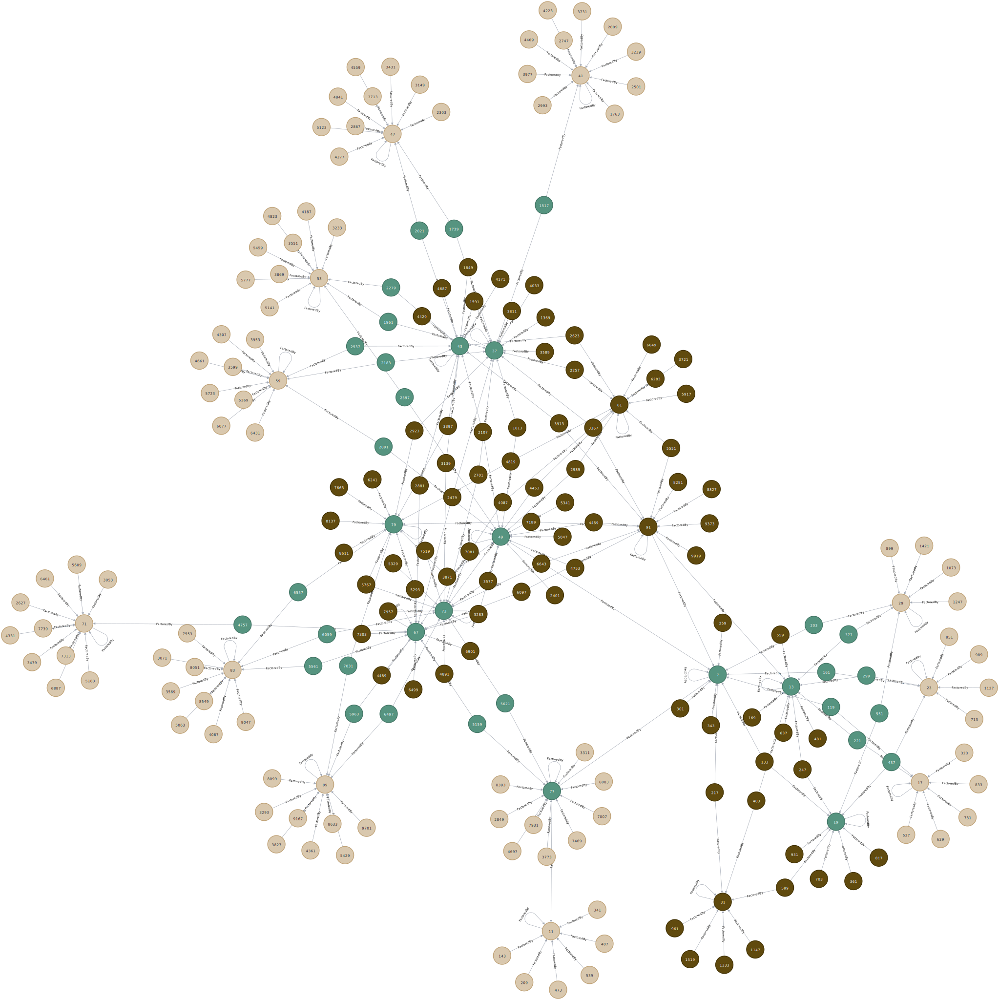

# Neo4j Prime Graph
Create Neo4j Prime numbers Graph and use it as a factoring Algorithm 

This Repo have cypher file for prime numbers and code to genrate them on a factored by relation. 

and another code for a batch algorithm that generate the files in batches.

# first 20 composite primes for [13]

# subgraph each with depth 20 batched with 20

# graph for numbers inbetween a range (from..to )

# Numbers that are factored by 17 and 7

# Numbers with 3 factors 7 one of them 

# any number with 4 factors 

# Query Prime numbers 

# Inter relation between prime numbers in brach 7 and branch 11

